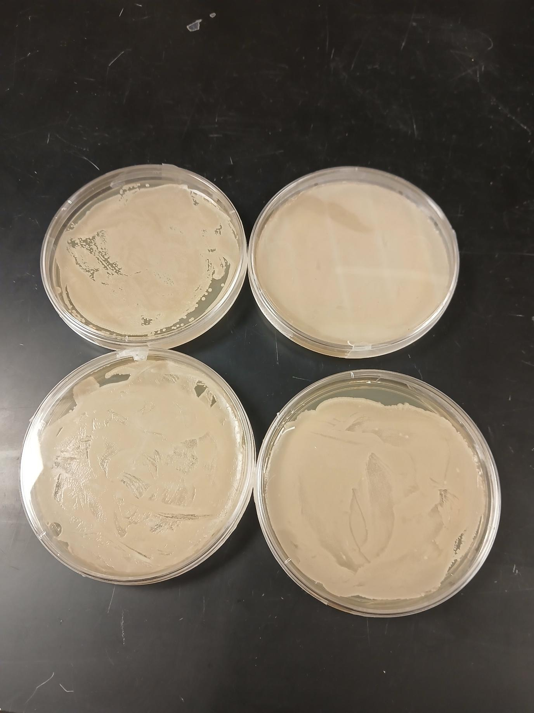

this is r code example
```{r R code example, include=TRUE, echo=FALSE}
#this is r code # WHAT I FIND IS FOR THE echo option to work as false, include needs to be true
summary(mtcars)
```

this is example of adding figures
```{r include figures}
library(ggplot2)
data("mtcars")
ggplot(mtcars, aes(x= wt, y = mpg)) +
  geom_point()

```

R MARKDOWN FORMATTING OPTIONS

# first level header

*this text is italics*

spacing is important. otherwise it will not work!

**this text is bold**

creating lists

1. one 
2. two
  - sub item

## adding links

[link to my github](https://github.com/Radhika-ri/reproducibility/blob/main/class%20coding%20challenge3_adv.R)


### images



#2 TABLES

```{r adding tables}
library(knitr)
kable(mtcars, digits = 3, format = "markdown")
```


